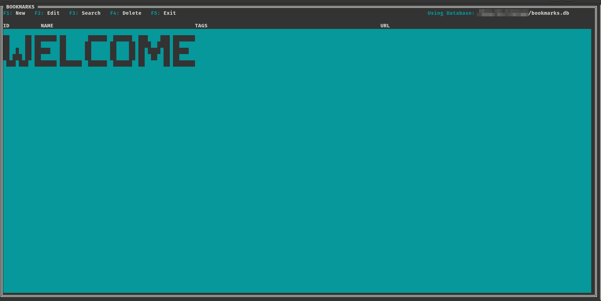
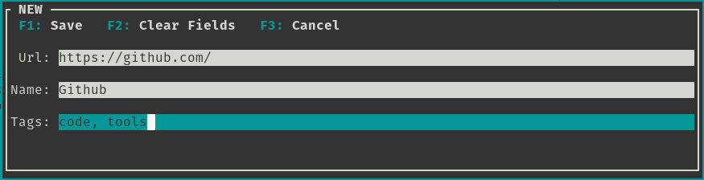
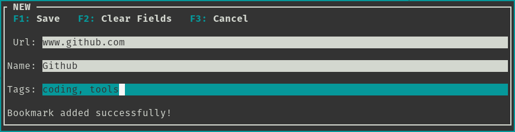
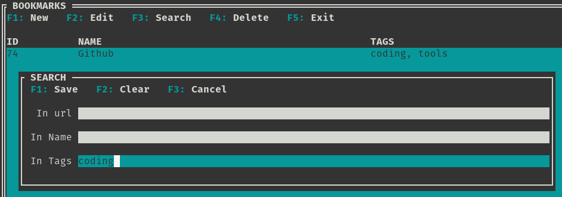
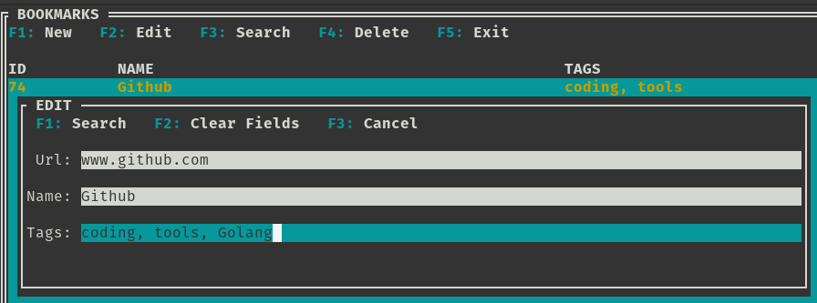

# BookmarksCLI v2

I did rewrite the tool, specially to change the user interface, the last one was a little bit cluttered and had limited space to visualize the bookmars when searching.

Because I am pretty satisfied with the look and feel of the tool, I will be adding more features when possible.

### What have this new version?
1. The main window is to visualize all the bookmarks and search results. The text columns separations are more noticeable now and do not depend on some
characters to use as separators. The listbox have also a header that help to know where a column starts.
Functions like add new bookmarks, search and edit for example are now in a individual window that can be invoked with F1, F2 keys and so.

2. The program validates there is no duplicated bookmarks (based on urls) names and tags will be repeated if needed.
3. The search feature will allow more flexible queries, for example if I want to search an url that contains the string 'www' and the string 'github' the query can be written as: www OR github.
The idea is to be able to have more flexible options to search the bookmarks, but this is a feature I am still working on.
4. Before inserting data into the database (sqlite) all text fields are sanitized to remove characters like single quotes, pound symbol... etc.
5. When running the program for the first time, it will ask the user to answer 2 important questions:
   a. Which web browser to use (use the full path: /usr/bin/firefox) to open the bookmarks.
   b. Where to store the bookmarks database (same as the web browser option, provide a full path and name for the databse, for example: /home/user/bookmarks.db). This preferences are stored in a file un /home/<user_name>/.config/bookmarks.cfg.

This tool was made with the library: https://github.com/VladimirMarkelov/clui 

## Here some screenshots

